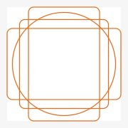
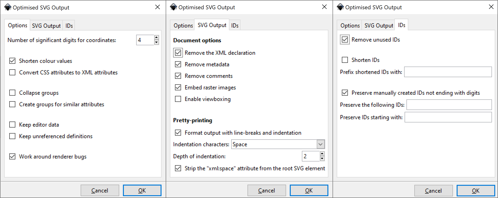

# Designer? Developer? Love Open Source? Everyone Can Participate!

### Help Design New Emoji

The next set of emojis are due to be released this year, we need your help to make them!

[Get started](https://github.com/hfg-gmuend/openmoji/issues/124)

### Improve Quality of Emojis

Design is subjective but we want our emoji to follow our style guide and look good.

[Get started](https://github.com/hfg-gmuend/openmoji/issues/142)

### Improve Consistency with Other Platforms

To be useful for communication, emoji need to convey the same idea. 

[Get started](https://github.com/hfg-gmuend/openmoji/issues/143)

## Styleguide
### Grid
The Grid serves as orientation for the size of the emojis. If possible your emojis **should stay inside the Grid**, but for edge cases use 4px of padding.

#### Basic Forms
The four basic forms define the possible extents, aiming to **visually balance** every icon. They don't always have to be fully filled.

Special cases are the “Emoji Faces”. They are placed inside a smaller circle to leave space for additions, such as tears or hands.

##### Examples

#### Basic Circles
Basic circles should give a consistent look to the entire set. Parts of the circles can also be used for rounded corners or wavy forms.

##### Examples

### Contour
The stroke settings are: **2px weight, round corners and ends**. Two overlapping contours should have a minimum gap of 2px.

#### Open Contour
The open contours result in a nice dynamic look and should be used for overlapping lines or perspective.

#### Contour and Fill
The fill should continue as if the contour was still there

#### Perspective
All objects should be displayed **2-dimensionally** from the front. In exceptional cases use an isometric projection for better distinction.

### Color
Please aim to mainly use the **primary colors**. Use the lighter colours as default colours and reserve the darker colors for shadowing. The four **secondary colors** should only be used in special cases.

[OpenMoji Color Palette (.svg)](https://openmoji.org/php/download_asset.php?type=url&target_url=https://raw.githubusercontent.com/hfg-gmuend/openmoji/master/guidelines/openmoji-color-palette.svg)

[Inkscape Palette (.gpl)](https://openmoji.org/php/download_asset.php?type=url&target_url=https://raw.githubusercontent.com/hfg-gmuend/openmoji/master/guidelines/openmoji-color-palette-inkscape.gpl)

[Illustrator Palette (.ase)](https://openmoji.org/php/download_asset.php?type=url&target_url=https://raw.githubusercontent.com/hfg-gmuend/openmoji/master/guidelines/openmoji-color-palette-adobe-illustrator.ase)

##### Primary Colors

##### Secondary Colors

### Shadow
The lighter color should be used for the fill, the darker color for the shading.

### Typography
We provide a custom font for emojis which have to contain typographic elements. Please use it for all text.

[openmoji-abc.svg](https://openmoji.org/php/download_asset.php?type=url&target_url=https://raw.githubusercontent.com/hfg-gmuend/openmoji/master/guidelines/openmoji-abc.svg)

### Topics
#### People

##### Full Body
People are pictured without clothing. Narrow their legs at the bottom. Arms are drawn as a single line. Static people are portrayed from the front, moving people from the side. Complex objects with a lot of overlapping forms should be simplified.

##### Bust
The face is elliptical. There is no neck, but there is a gap between head and shoulders. The eyes are in the middle of the head. For a neutral look, the mouth should align to the center point of the eyes.

##### Hands
The thumb converges slightly at the end. The lower side of the hand is rounded. Fingers have a width of 7px.

#### Arrows
The arrow head is made out of one basic form.

Arrows use double lines for every emoji. For special cases (e.g. icons for user interfaces), a single line is possible as well.

#### Buildings
Buildings are shown **from the front** with an entrance door. Details should be reduced strongly.

#### Animals and Plants
Plants are illustrated **organically**. Stems should always be a single line. Animals with a big body are illustrated from the side. The body shape should be organic, but not simplified too much.

#### Vehicles
Vehicles should be deduced from the shapes of **real world models** to avoid a toyish look. Vehicles are illustrated from the side. Tires are placed on the bottom line of the vehicle.

### Submission
#### SVG File Specification
- File Name:
	- **Unicode.svg**
- Example:
	- **1F469-200D-1F680.svg**
- Mandatory layers:
	- line
	- hair
	- skin-shadow
	- color
	- grid

#### Special Layers
You might run into situations where you need special layers such as **color-foreground** or **line-supplement**. Both are optional and should only be used if really necessary.

##### color-foreground
The red frame of the bike has to be in the foreground. Therefore, add a "color-foreground" layer and put it before "line" layer.

##### line-supplement
The black line of the exploding head has to be underneath the "color" layer. Therefore, add a "line-supplement" layer and put it behind the "color" layer.

#### Export
##### Adobe Illustrator
1. Click File > Export > Export for Screens
2. Click "gear" icon
3. Set "Format Settings" for SVG

##### Inkscape
1. Click File > Save As
2. Click Save as type: > Optimised SVG > Save
3. Set "Optimised SVG Output" Settings

##### Figma
1. Select frame
2. In the export pane select SVG and set `.figma` as suffix
3. Make sure *Contents Only* and *Include "id" Attribute* is checked
4. Run `node helpers/prettyfy-figma-svg.js`

#### Templates
[openmoji-template.ai](https://openmoji.org/php/download_asset.php?type=url&target_url=https://raw.githubusercontent.com/hfg-gmuend/openmoji/master/guidelines/openmoji-template.ai)

[openmoji-template.svg](https://openmoji.org/php/download_asset.php?type=url&target_url=https://raw.githubusercontent.com/hfg-gmuend/openmoji/master/guidelines/openmoji-template.svg)